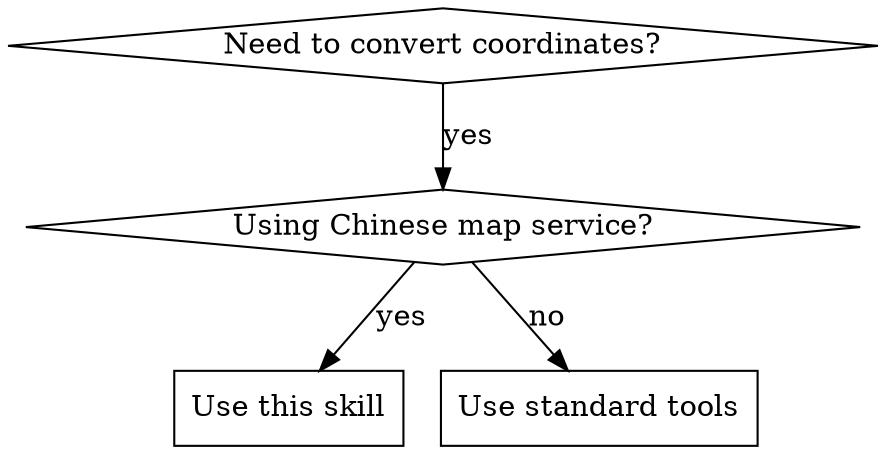

# Gcoord Skill Implementation Plan

> **For Claude:** REQUIRED SUB-SKILL: Use superpowers:executing-plans to implement this plan task-by-task.

**Goal:** 创建一个 Claude Code skill，用于在中国互联网地图坐标系（WGS84/GCJ02/BD09等）之间进行精确转换

**Architecture:** 基于 gcoord npm 库实现精确转换，采用 Prompt + Script 混合架构。SKILL.md 负责解析用户输入和识别坐标系，index.js 调用 gcoord 库执行实际转换。支持坐标数组、单点坐标、GeoJSON、批量文本等多种格式。

**Tech Stack:**
- gcoord v1.0.7（坐标转换核心库）
- Node.js（可执行脚本环境）
- Claude Code Skill 规范

---

## Task 1: 创建项目目录结构

**Files:**
- Create: `~/.claude/skills/gcoord/SKILL.md`
- Create: `~/.claude/skills/gcoord/index.js`
- Create: `~/.claude/skills/gcoord/package.json`
- Create: `~/.claude/skills/gcoord/test/test-coords.txt`

**Step 1: 创建技能目录**

```bash
mkdir -p ~/.claude/skills/gcoord/test
```

**Step 2: 验证目录创建**

Run: `ls -la ~/.claude/skills/gcoord/`
Expected: 显示空的 gcoord 目录

**Step 3: 初始化 npm 项目**

```bash
cd ~/.claude/skills/gcoord
npm init -y
```

**Step 4: 安装 gcoord 依赖**

```bash
npm install gcoord
```

**Step 5: 验证依赖安装**

Run: `ls ~/.claude/skills/gcoord/node_modules/ | grep gcoord`
Expected: 显示 gcoord 目录

---

## Task 2: 编写 package.json

**Files:**
- Modify: `~/.claude/skills/gcoord/package.json`

**Step 1: 更新 package.json**

```bash
cat > ~/.claude/skills/gcoord/package.json << 'EOF'
{
  "name": "gcoord-skill",
  "version": "1.0.0",
  "description": "Claude Code skill for converting geographic coordinates between WGS84/GCJ02/BD09 systems",
  "main": "index.js",
  "scripts": {
    "test": "node test/test.js"
  },
  "keywords": [
    "claude-code-skill",
    "coordinate",
    "gcoord",
    "wgs84",
    "gcj02",
    "bd09"
  ],
  "dependencies": {
    "gcoord": "^1.0.7"
  },
  "author": "zhangyuting",
  "license": "MIT"
}
EOF
```

**Step 2: 验证 JSON 格式**

Run: `cat ~/.claude/skills/gcoord/package.json | python3 -m json.tool`
Expected: JSON 格式正确，无错误输出

**Step 3: Commit**

```bash
cd ~/.claude/skills/gcoord
git init
git add package.json
git commit -m "feat: add package.json with gcoord dependency"
```

---

## Task 3: 编写 SKILL.md

**Files:**
- Create: `~/.claude/skills/gcoord/SKILL.md`

**Step 1: 创建 SKILL.md 文件**

```bash
cat > ~/.claude/skills/gcoord/SKILL.md << 'EOF'
---
name: gcoord
description: Use when converting coordinates between WGS84, GCJ02, BD09, BD09MC, or WebMercator coordinate systems for Chinese map services (Baidu, Amap, Google China, etc.)
---

# Gcoord - 地理坐标系转换

## Overview

处理中国互联网地图坐标系不统一的问题，支持 WGS84/GCJ02/BD09/BD09MC/WebMercator 等坐标系之间的精确转换。

## When to Use



**Use when:**
- GPS 坐标需要显示在高德/百度/腾讯地图上
- 从一个地图平台切换到另一个平台
- 统一不同来源的坐标数据
- 处理 GeoJSON 或批量坐标数据

## Coordinate Systems Reference

| 代码 | 中文名称 | 别名 | 适用平台 |
|------|----------|------|----------|
| WGS84 | 地球坐标系 | GPS, wgs84, 地球坐标 | GPS 设备原始坐标 |
| GCJ02 | 火星坐标系 | 高德, amap, 腾讯, gcj02, 火星坐标 | 高德地图、腾讯地图 |
| BD09 | 百度坐标系 | 百度, baidu, bd09 | 百度地图 |
| BD09MC | 百度米制坐标 | bd09mc, 百度米制 | 百度地图米制 |
| WebMercator | 墨卡托投影 | 墨卡托, webmercator, epsg3857 | Web 地图投影 |

## Supported Input/Output Formats

| 格式 | 示例 | 说明 |
|------|------|------|
| 坐标数组 | `[116.403988, 39.914266]` | JSON 数组格式 |
| 单点坐标 | `116.403988, 39.914266` | 逗号或空格分隔 |
| GeoJSON | `{ "type": "Point", "coordinates": [...] }` | 完整 GeoJSON 对象 |
| 批量文本 | 每行一个坐标 | 多行文本处理 |

**输出格式默认与输入格式相同。**

## Usage Examples

### Command Format

```
/gcoord [坐标] --from [源坐标系] --to [目标坐标系]

# 示例
/gcoord 116.403988,39.914266 --from wgs84 --to bd09
/gcoord [116.403988, 39.914266] from gps to 百度
```

### Natural Language Format

```
"帮我把这个坐标转换成高德坐标系"
"GPS 坐标转百度地图"
"WGS84 转 GCJ02"
```

## Implementation

对于精确转换，使用 `index.js` 脚本调用 gcoord 库：

```bash
node index.js --input "[116.403988, 39.914266]" --from WGS84 --to BD09
```

## Common Mistakes

| 错误 | 正确做法 |
|------|----------|
| GPS 坐标直接放百度地图 | 先转为 BD09 坐标系 |
| 混淆经度纬度顺序 | 始终是 [经度, 纬度] |
| 忘记 GeoJSON 是原地修改 | 转换后原始对象会改变 |

## Legal Notice

使用时请遵守《中华人民共和国测绘法》和 GB 20263―2006 标准。
EOF
```

**Step 2: 验证文件创建**

Run: `cat ~/.claude/skills/gcoord/SKILL.md | head -20`
Expected: 显示 SKILL.md 前 20 行内容

**Step 3: Commit**

```bash
cd ~/.claude/skills/gcoord
git add SKILL.md
git commit -m "feat: add SKILL.md with coordinate conversion reference"
```

---

## Task 4: 编写 index.js

**Files:**
- Create: `~/.claude/skills/gcoord/index.js`

**Step 1: 创建 index.js 文件**

```bash
cat > ~/.claude/skills/gcoord/index.js << 'EOF'
#!/usr/bin/env node

const gcoord = require('gcoord');

// 坐标系别名映射
const CRS_ALIAS = {
  // WGS84 别名
  'wgs84': 'WGS84',
  'wgs-84': 'WGS84',
  'gps': 'WGS84',
  '地球坐标': 'WGS84',
  '地球坐标系': 'WGS84',

  // GCJ02 别名
  'gcj02': 'GCJ02',
  'gcj-02': 'GCJ02',
  '火星坐标': 'GCJ02',
  '火星坐标系': 'GCJ02',
  '高德': 'GCJ02',
  'amap': 'GCJ02',
  '腾讯': 'GCJ02',

  // BD09 别名
  'bd09': 'BD09',
  'bd-09': 'BD09',
  '百度': 'BD09',
  'baidu': 'BD09',
  'bmap': 'BD09',

  // BD09MC 别名
  'bd09mc': 'BD09MC',
  'bd09-mc': 'BD09MC',
  '百度米制': 'BD09MC',

  // WebMercator 别名
  'webmercator': 'WebMercator',
  '墨卡托': 'WebMercator',
  'epsg3857': 'WebMercator',
  'epsg-3857': 'WebMercator'
};

/**
 * 解析输入格式
 */
function parseInput(input) {
  // GeoJSON 格式
  if (input.trim().startsWith('{')) {
    return { type: 'geojson', data: JSON.parse(input) };
  }

  // 数组格式 [lng, lat]
  if (input.trim().startsWith('[')) {
    return { type: 'array', data: JSON.parse(input) };
  }

  // 批量文本格式（多行）
  if (input.includes('\n')) {
    const lines = input.trim().split('\n');
    const coords = lines.map(line => {
      const parts = line.split(/[,\s]+/).filter(Boolean);
      return [parseFloat(parts[0]), parseFloat(parts[1])];
    });
    return { type: 'batch', data: coords };
  }

  // 单点坐标格式
  const parts = input.split(/[,\s]+/).filter(Boolean);
  if (parts.length >= 2) {
    return { type: 'point', data: [parseFloat(parts[0]), parseFloat(parts[1])] };
  }

  throw new Error('无法解析输入格式');
}

/**
 * 格式化输出（保持与输入相同格式）
 */
function formatOutput(result, inputType) {
  switch (inputType) {
    case 'geojson':
      return JSON.stringify(result);
    case 'array':
      return JSON.stringify(result);
    case 'batch':
      return result.map(c => c.join(', ')).join('\n');
    case 'point':
      return result.join(', ');
    default:
      return JSON.stringify(result);
  }
}

/**
 * 标准化坐标系代码
 */
function normalizeCRS(code) {
  const normalized = code.toLowerCase().trim();
  return CRS_ALIAS[normalized] || code.toUpperCase();
}

// 命令行参数解析
const args = process.argv.slice(2);
const params = {};
for (let i = 0; i < args.length; i += 2) {
  const key = args[i].replace(/^-+/, '');
  params[key] = args[i + 1];
}

// 执行转换
try {
  const input = parseInput(params.input || params.i || '');
  const from = normalizeCRS(params.from || params.f || 'WGS84');
  const to = normalizeCRS(params.to || params.t || 'GCJ02');

  let result;
  if (input.type === 'geojson') {
    result = gcoord.transform(input.data, gcoord[from], gcoord[to]);
  } else {
    result = gcoord.transform(input.data, gcoord[from], gcoord[to]);
  }

  const output = formatOutput(result, input.type);

  console.log(`转换: ${from} → ${to}`);
  console.log('结果:', output);

} catch (error) {
  console.error('错误:', error.message);
  process.exit(1);
}
EOF
```

**Step 2: 添加执行权限**

```bash
chmod +x ~/.claude/skills/gcoord/index.js
```

**Step 3: 验证语法**

Run: `node -c ~/.claude/skills/gcoord/index.js`
Expected: 无语法错误

**Step 4: Commit**

```bash
cd ~/.claude/skills/gcoord
git add index.js
git commit -m "feat: add index.js with coordinate conversion logic"
```

---

## Task 5: 创建测试数据

**Files:**
- Create: `~/.claude/skills/gcoord/test/test-coords.txt`

**Step 1: 创建测试数据文件**

```bash
cat > ~/.claude/skills/gcoord/test/test-coords.txt << 'EOF'
# Gcoord 坐标转换测试数据
# 格式: 经度,纬度

# 天安门广场
116.397128, 39.916527

# 上海东方明珠
121.499763, 31.239586

# 广州塔
113.324520, 23.106414

# 深圳市民中心
114.057868, 22.543099

# 成都大熊猫基地
104.146549, 30.735421
EOF
```

**Step 2: 验证文件创建**

Run: `cat ~/.claude/skills/gcoord/test/test-coords.txt`
Expected: 显示测试数据内容

**Step 3: Commit**

```bash
cd ~/.claude/skills/gcoord
git add test/test-coords.txt
git commit -m "test: add test coordinates data"
```

---

## Task 6: 验证单点坐标转换

**Step 1: 测试 WGS84 转 GCJ02**

Run: `node ~/.claude/skills/gcoord/index.js --input "116.403988,39.914266" --from WGS84 --to GCJ02`
Expected: 输出转换后的坐标

**Step 2: 测试 WGS84 转 BD09**

Run: `node ~/.claude/skills/gcoord/index.js --input "116.403988,39.914266" --from WGS84 --to BD09`
Expected: 输出转换后的坐标

**Step 3: 测试数组格式**

Run: `node ~/.claude/skills/gcoord/index.js --input "[116.403988, 39.914266]" --from WGS84 --to GCJ02`
Expected: 输出数组格式结果

**Step 4: 记录测试结果**

记录上述测试的输出，验证转换是否正确。

---

## Task 7: 在 Claude Code 中测试 Skill

**Step 1: 重启 Claude Code**

关闭并重新启动 Claude Code 以加载新 skill。

**Step 2: 测试命令格式调用**

在 Claude Code 中输入:
```
/gcoord 116.403988,39.914266 --from wgs84 --to bd09
```

Expected: Claude Code 识别并执行坐标转换

**Step 3: 测试自然语言调用**

在 Claude Code 中输入:
```
帮我把 116.403988,39.914266 转换成高德坐标系
```

Expected: Claude Code 理解意图并执行转换

**Step 4: 测试批量转换**

在 Claude Code 中输入:
```
帮我把 test/test-coords.txt 中的坐标从 WGS84 转换为 GCJ02
```

Expected: 处理批量坐标转换

**Step 5: 记录测试结果**

记录所有测试用例的结果。

---

## Task 8: 创建 README 文档

**Files:**
- Create: `~/.claude/skills/gcoord/README.md`

**Step 1: 创建 README.md**

```bash
cat > ~/.claude/skills/gcoord/README.md << 'EOF'
# Gcoord Skill

用于 Claude Code 的地理坐标系转换工具，支持 WGS84/GCJ02/BD09 等坐标系互转。

## 安装

此 skill 应安装在 `~/.claude/skills/gcoord/` 目录下。

## 使用

### 命令格式

\`\`\`
/gcoord [坐标] --from [源坐标系] --to [目标坐标系]
\`\`\`

### 示例

\`\`\`
# GPS 坐标转百度地图
/gcoord 116.403988,39.914266 --from wgs84 --to bd09

# 高德转 WGS84
/gcoord [116.403988, 39.914266] --from gcj02 --to wgs84
\`\`\`

### 支持的坐标系

| 代码 | 中文名称 | 适用平台 |
|------|----------|----------|
| WGS84 | 地球坐标系 | GPS 原始坐标 |
| GCJ02 | 火星坐标系 | 高德、腾讯地图 |
| BD09 | 百度坐标系 | 百度地图 |
| BD09MC | 百度米制坐标 | 百度地图米制 |
| WebMercator | 墨卡托投影 | Web 地图 |

### 测试

\`\`\`bash
cd ~/.claude/skills/gcoord
npm test
\`\`\`

## 依赖

- gcoord v1.0.7

## 许可证

MIT
EOF
```

**Step 2: Commit**

```bash
cd ~/.claude/skills/gcoord
git add README.md
git commit -m "docs: add README with usage instructions"
```

---

## Task 9: 最终验证与文档

**Step 1: 完整功能测试**

执行所有测试用例，确认功能正常。

**Step 2: 检查文件结构**

Run: `ls -la ~/.claude/skills/gcoord/`
Expected: 显示所有必要文件

**Step 3: 更新文档**

根据测试结果更新 README.md 和 SKILL.md。

**Step 4: 最终 Commit**

```bash
cd ~/.claude/skills/gcoord
git add .
git commit -m "chore: final adjustments and documentation updates"
```

---

## 验收标准

- [ ] Skill 能被 Claude Code 正确识别和加载
- [ ] 单点坐标转换功能正常
- [ ] 数组格式转换功能正常
- [ ] 批量坐标转换功能正常
- [ ] GeoJSON 转换功能正常
- [ ] 坐标系别名识别正常
- [ ] 输出格式与输入格式保持一致
- [ ] 文档完整清晰
