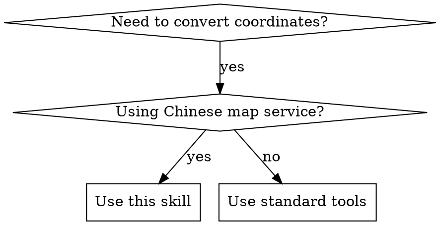

# Gcoord - 地理坐标系转换

## Overview

处理中国互联网地图坐标系不统一的问题，支持 WGS84/GCJ02/BD09/BD09MC/WebMercator 等坐标系之间的精确转换。

## When to Use



**Use when:**
- GPS 坐标需要显示在高德/百度/腾讯地图上
- 从一个地图平台切换到另一个平台
- 统一不同来源的坐标数据
- 处理 GeoJSON 或批量坐标数据

## Coordinate Systems Reference

| 代码 | 中文名称 | 别名 | 适用平台 |
|------|----------|------|----------|
| WGS84 | 地球坐标系 | GPS, wgs84, 地球坐标 | GPS 设备原始坐标 |
| GCJ02 | 火星坐标系 | 高德, amap, 腾讯, gcj02, 火星坐标 | 高德地图、腾讯地图 |
| BD09 | 百度坐标系 | 百度, baidu, bd09 | 百度地图 |
| BD09MC | 百度米制坐标 | bd09mc, 百度米制 | 百度地图米制 |
| WebMercator | 墨卡托投影 | 墨卡托, webmercator, epsg3857 | Web 地图投影 |

## Supported Input/Output Formats

| 格式 | 示例 | 说明 |
|------|------|------|
| 坐标数组 | `[116.403988, 39.914266]` | JSON 数组格式 |
| 单点坐标 | `116.403988, 39.914266` | 逗号或空格分隔 |
| GeoJSON | `{ "type": "Point", "coordinates": [...] }` | 完整 GeoJSON 对象 |
| 批量文本 | 每行一个坐标 | 多行文本处理 |

**输出格式默认与输入格式相同。**

## Usage Examples

### Command Format

```
/gcoord [坐标] --from [源坐标系] --to [目标坐标系]

# 示例
/gcoord 116.403988,39.914266 --from wgs84 --to bd09
/gcoord [116.403988, 39.914266] from gps to 百度
```

### Natural Language Format

```
"帮我把这个坐标转换成高德坐标系"
"GPS 坐标转百度地图"
"WGS84 转 GCJ02"
```

## Implementation

对于精确转换，使用 `index.js` 脚本调用 gcoord 库：

```bash
node index.js --input "[116.403988, 39.914266]" --from WGS84 --to BD09
```

## Common Mistakes

| 错误 | 正确做法 |
|------|----------|
| GPS 坐标直接放百度地图 | 先转为 BD09 坐标系 |
| 混淆经度纬度顺序 | 始终是 [经度, 纬度] |
| 忘记 GeoJSON 是原地修改 | 转换后原始对象会改变 |

## Legal Notice

使用时请遵守《中华人民共和国测绘法》和 GB 20263―2006 标准。
