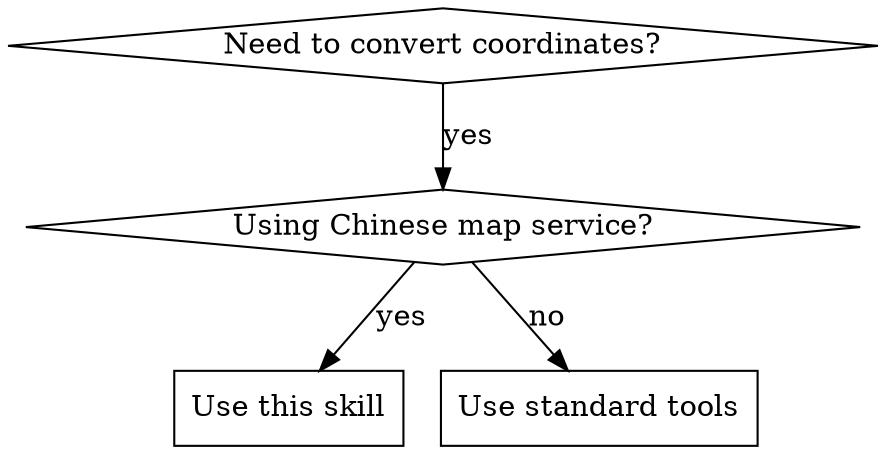

# Gcoord - 地理坐标系转换

## Overview

处理中国互联网地图坐标系不统一的问题，支持 WGS84/GCJ02/BD09/BD09MC/WebMercator 等坐标系之间的精确转换。

## When to Use



**Use when:**
- GPS 坐标需要显示在高德/百度/腾讯地图上
- 从一个地图平台切换到另一个平台
- 统一不同来源的坐标数据
- 处理 GeoJSON 或批量坐标数据

## Coordinate Systems Reference

| 代码 | 中文名称 | 别名 | 适用平台 |
|------|----------|------|----------|
| WGS84 | 地球坐标系 | GPS, wgs84, 地球坐标 | GPS 设备原始坐标 |
| GCJ02 | 火星坐标系 | 高德, amap, 腾讯, gcj02, 火星坐标 | 高德地图、腾讯地图 |
| BD09 | 百度坐标系 | 百度, baidu, bd09 | 百度地图 |
| BD09MC | 百度米制坐标 | bd09mc, 百度米制 | 百度地图米制 |
| WebMercator | 墨卡托投影 | 墨卡托, webmercator, epsg3857 | Web 地图投影 |

## Supported Input/Output Formats

| 格式 | 示例 | 说明 |
|------|------|------|
| 坐标数组 | `[116.403988, 39.914266]` | JSON 数组格式 |
| 单点坐标 | `116.403988, 39.914266` | 逗号或空格分隔 |
| GeoJSON | `{ "type": "Point", "coordinates": [...] }` | 完整 GeoJSON 对象 |
| 批量文本 | 每行一个坐标 | 多行文本处理 |

**输出格式默认与输入格式相同。**

## Usage Examples

### Command Format

```
/gcoord [坐标] --from [源坐标系] --to [目标坐标系]

# 示例
/gcoord 116.403988,39.914266 --from wgs84 --to bd09
/gcoord [116.403988, 39.914266] from gps to 百度
```

### Natural Language Format

```
"帮我把这个坐标转换成高德坐标系"
"GPS 坐标转百度地图"
"WGS84 转 GCJ02"
```

### Interactive Examples

```
# Missing parameters - Claude will prompt
"帮我转换坐标 116.403988,39.914266"
→ Claude prompts for source and target coordinate systems

# Clear target from context
"把 116.403988,39.914266 在百度地图上显示"
→ Claude only asks for source (target is clearly BD09)

# Explicit parameters - no prompts
/gcoord 116.403988,39.914266 --from WGS84 --to BD09
→ Direct conversion, no questions asked
```

## Interactive Parameter Selection

### When to Ask User

在使用 `AskUserQuestion` 工具前，先尝试从用户输入中推断坐标系。只有在无法推断时才询问：

**优先级判断**:
1. 命令行参数明确指定 (`--from`, `--to`)
2. 自然语言中明确提及 (GPS、高德、百度、WGS84、GCJ02 等)
3. 上下文推断 (文件名如 `*-gcj02.geojson`、前文对话)
4. 无法推断 → 使用 AskUserQuestion

### Question Format

当需要询问坐标系时，使用以下格式：

**源坐标系询问**:
```
AskUserQuestion({
  questions: [{
    question: "请选择源坐标系（您当前的坐标使用什么坐标系？）",
    header: "源坐标系",
    multiSelect: false,
    options: [
      {
        label: "WGS84 (GPS)",
        description: "GPS 设备原始坐标，地球坐标"
      },
      {
        label: "GCJ02 (高德/腾讯)",
        description: "高德地图、腾讯地图坐标系"
      },
      {
        label: "BD09 (百度)",
        description: "百度地图坐标系"
      },
      {
        label: "BD09MC (百度米制)",
        description: "百度地图米制坐标"
      },
      {
        label: "WebMercator (墨卡托)",
        description: "Web 地图投影坐标"
      }
    ]
  }]
})
```

**目标坐标系询问**:
- 使用相同的选项
- 修改 question 为 "请选择目标坐标系（您要转换到哪个坐标系？）"
- header 改为 "目标坐标系"

### Natural Language Recognition Patterns

在询问前，检查用户是否通过自然语言指定了坐标系：

**源坐标系关键词**:
- "GPS坐标", "WGS84", "地球坐标", "原始坐标" → WGS84
- "高德", "腾讯", "火星坐标", "gcj02" → GCJ02
- "百度", "baidu", "bd09" → BD09
- "墨卡托", "Web Mercator" → WebMercator

**目标坐标系关键词**:
- "转成高德", "在高德地图显示", "for Amap" → GCJ02
- "转成百度", "在百度地图显示", "for Baidu" → BD09
- "转成GPS", "转成WGS84", "to WGS84" → WGS84

### Interaction Examples

**场景 1: 完全未指定**
```
用户: 帮我转换 116.403988,39.914266

Claude:
1. 无法从输入推断源和目标坐标系
2. 询问源坐标系 → 用户选择: WGS84
3. 询问目标坐标系 → 用户选择: GCJ02
4. 调用: node index.js --input "116.403988,39.914266" --from WGS84 --to GCJ02
```

**场景 2: 仅指定目标**
```
用户: 把 116.403988,39.914266 在百度地图上显示

Claude:
1. 从上下文推断: 目标 = BD09 (明确)
2. 源坐标系不明确 → 询问用户
3. 用户选择: WGS84
4. 调用: node index.js --input "116.403988,39.914266" --from WGS84 --to BD09
```

**场景 3: 明确指定（不询问）**
```
用户: GPS转高德: 116.403988,39.914266

Claude:
1. 从自然语言识别: 源=WGS84, 目标=GCJ02
2. 直接调用: node index.js --input "116.403988,39.914266" --from WGS84 --to GCJ02
```

## Implementation

对于精确转换，使用 `index.js` 脚本调用 gcoord 库：

```bash
node index.js --input "[116.403988, 39.914266]" --from WGS84 --to BD09
```

## Common Mistakes

| 错误 | 正确做法 |
|------|----------|
| GPS 坐标直接放百度地图 | 先转为 BD09 坐标系 |
| 混淆经度纬度顺序 | 始终是 [经度, 纬度] |
| 忘记 GeoJSON 是原地修改 | 转换后原始对象会改变 |

## Legal Notice

使用时请遵守《中华人民共和国测绘法》和 GB 20263―2006 标准。
